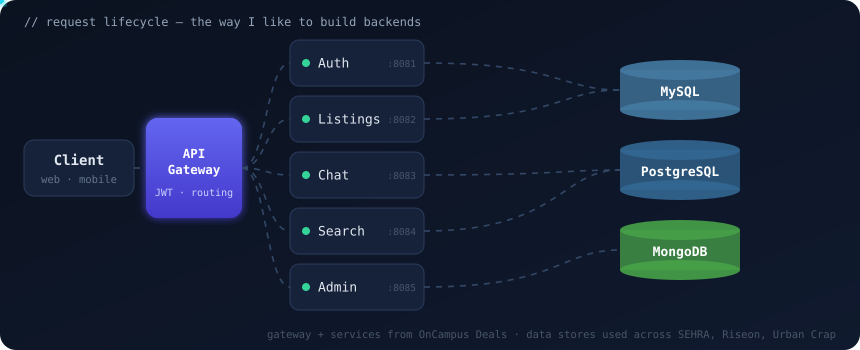

---

### 👋 About me

- 🎓 CS undergrad at **IIIT Bangalore**
- ⚙️ **Backend-first engineer.** I design services, APIs and data models, then wire them together into systems that scale
- 🏗️ Built **microservice platforms** with Spring Boot services behind an API gateway, stateless **JWT auth** and **role-based access control**
- 🗄️ Comfortable across **MySQL, PostgreSQL and MongoDB**, from schema design to picking the right store for the job
- 🔬 Interested in the layers underneath too: I've written **processor and cache simulators** from scratch

---

### 🧰 Tech stack

  

---

### 🚀 Featured projects

<table>
<tr>
<td colspan="2" valign="top">

#### 🛒 [OnCampus Deals](https://github.com/kodercrish/OnCampus-Deals) · flagship
A campus marketplace for buying, selling and chatting about second-hand goods. It is split into **five Spring Boot microservices** (auth, listings, search, chat, admin), each with its own responsibility. A **Spring Cloud Gateway** sits in front and handles JWT validation and routing, with MySQL for persistence and Cloudinary for media.

`Java 21` `Spring Boot 3.5` `Spring Cloud Gateway` `Microservices` `JWT` `MySQL` `Gradle`

</td>
</tr>
<tr>
<td width="50%" valign="top">

#### 🏥 [SEHRA](https://github.com/kodercrish/SEHRA)
Secure Exchange of Health Record Access: a role-based platform that manages the full lifecycle of clinical data-access requests, with RSA-signed JWTs and role-scoped access for every actor.

`Spring Boot 4` `PostgreSQL` `JWT (RS256)` `RBAC`

</td>
<td width="50%" valign="top">

#### 🧭 [Urban Crap](https://github.com/kodercrish/Urban-Crap)
A home-services marketplace. The Spring Boot backend calls a **native C++ Dijkstra engine through JNI** to route each order to service agents within range.

`Spring Boot` `MongoDB` `C++ / JNI` `Graph algorithms`

</td>
</tr>
<tr>
<td width="50%" valign="top">

#### 📈 [Riseon](https://github.com/kodercrish/Riseon) · [live ↗](https://riseon.vercel.app)
A REST API for planning, journaling and tracking resolutions, with stateless JWT sessions in HttpOnly cookies, BCrypt hashing, and a Dockerised backend.

`Spring Boot` `Spring Security` `MySQL` `Docker`

</td>
<td width="50%" valign="top">

#### 🖥️ [Computer Architecture](https://github.com/kodercrish/Computer-Architecture)
Low-level simulators: an IAS processor with its own assembler, a MIPS processor, and a configurable cache memory design.

`Python` `MIPS Assembly` `Cache design`

</td>
</tr>
</table>

---

### 🏗️ How I build backends

  

